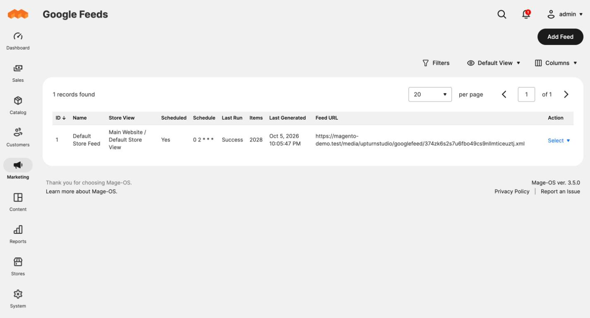

# UpturnStudio Google Feeds

Google Merchant Center product feeds for Magento 2, plus the order data needed
to compare Google Ads spend with real sales per product.



## What it does

| | |
|---|---|
| **Product feeds** | Build XML feeds for Merchant Center. Choose which products go in and map each Google attribute to a product attribute, fixed text, a template or a built-in value such as price or availability. |
| **Ad click capture** | When a shopper arrives from a Google ad, the click ID is remembered and recorded on the order they place. |
| **Reporting API** | An external system can read click-attributed orders and push Google-specific values (category, GTIN, custom labels, better titles) for any SKU. |

The module does not connect to Google Ads itself. A separate reporting system
fetches spend and clicks per product from Google Ads and joins them to this
module's order data by SKU. That system is not part of this module.

## Requirements

- Magento 2 or Mage-OS (tested on Mage-OS 3.5.0 with PHP 8.4)
- Inventory Management (MSI) enabled
- Magento cron running

## Install

```bash
composer require upturnstudio/module-google-feed
bin/magento module:enable UpturnStudio_GoogleFeed
bin/magento setup:upgrade
bin/magento setup:di:compile
bin/magento cache:flush
```

## Quick start

1. Go to **Marketing > SEO & Search > Google Feeds** and click **Add Feed**.
2. Name it, pick the store view, and save. The attribute mapping is pre-filled.
3. Click **Generate Now**, or run:

   ```bash
   bin/magento upturnstudio:google-feed:generate
   ```

4. Copy the **Feed URL** from the grid into Merchant Center as a scheduled
   fetch.

## User guides

| Guide | Covers |
|---|---|
| [Getting started](user-guides/getting-started.md) | Install, first feed, connecting Merchant Center |
| [Creating a feed](user-guides/creating-a-feed.md) | Feed settings and choosing which products to include |
| [Attribute mapping](user-guides/attribute-mapping.md) | Mapping Google attributes, templates, variants, Google categories |
| [Generating feeds](user-guides/generating-feeds.md) | Schedules, Generate Now, the command line, run status |
| [Google attribute values per product](user-guides/google-attribute-values.md) | Values pushed through the API and where to see them |
| [Ad click tracking](user-guides/ad-click-tracking.md) | How clicks are captured and tied to orders |
| [Subscription and API access](user-guides/subscription-and-api-access.md) | The optional subscription key and connecting the reporting system |
| [Troubleshooting](user-guides/troubleshooting.md) | Common problems and how to fix them |

For developers of the reporting system: [REST API reference](docs/api.md).

## Good to know

- Configurable products are listed as their variants, grouped by the parent
  SKU.
- A feed file is replaced only when the new one is complete, so Merchant
  Center never fetches half a feed.
- Everything in this module works without a subscription key. The key is
  optional and connects the store to the reporting service, which adds content
  improvement suggestions and Google Ads spend vs ROI tracking.
- The key is not yet verified against a service; that check is still to be
  connected.
- There is no screen for mapping store categories to Google's category list.
  See [Attribute mapping](user-guides/attribute-mapping.md#google-product-category)
  for the options.

## Permissions

Under **System > Permissions > User Roles** (and on Integrations):

| Resource | Grants |
|---|---|
| Google Feeds > Manage Feeds | The feed grid and form |
| Google Feeds > API > Read Feed List | Feed list endpoint |
| Google Feeds > API > Read and Write Google Attribute Values | Attribute value endpoints |
| Google Feeds > API > Read Click-Attributed Orders | Orders endpoint |
| Stores > Configuration > Google Feeds Section | The settings page |

## Extending

- **More Google attributes**: add items to the `attributes` argument of
  `UpturnStudio\GoogleFeed\Model\Feed\GoogleAttributePool` in your `di.xml`.
- **More built-in value sources**: implement
  `UpturnStudio\GoogleFeed\Model\Feed\Resolver\ResolverInterface` and add it to
  the `resolvers` argument of `...\Resolver\ResolverPool`.
- **A different subscription check**: replace the preference for
  `UpturnStudio\GoogleFeed\Api\LicenceValidatorInterface`.

## Tests

```bash
vendor/bin/phpunit -c dev/tests/unit/phpunit.xml.dist app/code/UpturnStudio/GoogleFeed/Test/Unit
```
