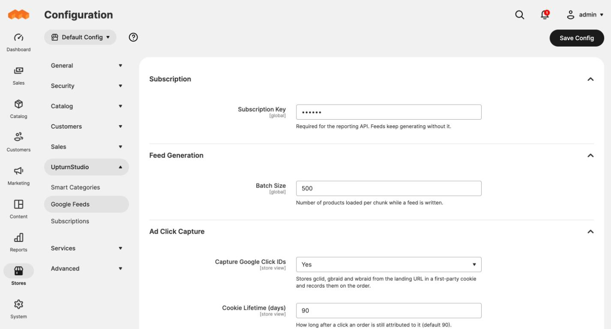

# Ad click tracking

The module remembers which Google ad click brought a shopper to your store and
records it on the order they place. That is what lets the reporting system
compare what a product's ads cost with what they sold.

## How it works

1. Google adds a click ID to the link when someone clicks your ad, for example
   `?gclid=Cj0KCQ...`. This needs **auto-tagging** turned on in Google Ads,
   which it is by default.
2. When the shopper lands on your store, a small script saves the click ID in
   a cookie in their browser, along with the time, the page they landed on
   and, on a product page, that product's SKU.
3. When they place an order, the click is saved against it.

Three kinds of Google click ID are captured: `gclid`, `gbraid` and `wbraid`.
The last two are used for some traffic from Apple devices.

## Settings

**Stores > Configuration > UpturnStudio > Google Feeds > Ad Click Capture**

| Setting | What it does |
|---|---|
| **Capture Google Click IDs** | Turns capture on or off. On by default. Can be set per store view. |
| **Cookie Lifetime (days)** | How long after a click an order still counts as coming from it. 90 by default, which matches Google's longest conversion window. |
| **Respect Cookie Restriction Mode** | When Magento's Cookie Restriction Mode is on, the cookie is only saved after the shopper accepts cookies. On by default. |

## What gets recorded on an order

| | |
|---|---|
| Click ID | The `gclid`, `gbraid` or `wbraid` |
| Landing SKU | The product whose page the click landed on, when it was a product page |
| Landing page | The page address, without anything after the `?` |
| Click time | When the shopper arrived |

The landing SKU is kept separately from what was bought. Someone who clicks an
ad for one bag and buys a different one shows up as a click on the first and a
sale of the second, so both views are available in reporting.

## Rules to be aware of

- **Last click wins.** A newer ad click replaces an older one.
- **Every order in the window counts.** A shopper who orders twice within the
  cookie lifetime has both orders tied to the same click.
- **Same browser only.** A click on a phone followed by an order on a laptop is
  not connected. Google's own conversion tracking can model that; this cannot.
- **Admin orders are never attributed.** An order placed by staff in the admin
  does not pick up a click.
- **Only orders placed after the module was installed** carry click data.

## Privacy and consent

- The cookie is first-party: set by your own store, readable only by your
  store. It is named `upturnstudio_gf_click`.
- It contains the click ID, the landing page address without its query string,
  the landing SKU and a timestamp. It holds no personal details.
- With Magento's Cookie Restriction Mode on, nothing is saved until the
  shopper accepts cookies. If they arrive from an ad before accepting, the
  click is held for that browser tab and saved as soon as they accept.
- If you use a different consent banner, it will not be detected. Turn capture
  off, or speak to your developer about tying it to your banner.
- Add the cookie to your cookie policy.

## Headless storefronts

A headless storefront on its own domain cannot send Magento the click cookie.
It can attach the click to the shopper's cart instead, with one REST call or
GraphQL mutation, once the cart exists. The click is then recorded on the order
the cart becomes, and wins over any cookie. The call needs no token for a guest
cart. See the [REST reference](../docs/api.md#post-guest-cartscartidclick-and-post-cartsmineclick).

## Theme compatibility

The script has no dependencies, so it works on Luma-based and Hyvä themes, and
on pages served from full-page cache or Varnish. It has been tested on Luma.

## Checking it works

1. Open a product page on your store with `?gclid=TEST123` added to the
   address.
2. Place a test order in the same browser.
3. Ask the reporting system for the order, or call the orders endpoint
   described in the [REST API reference](../docs/api.md). The order should
   appear with `gclid` set to `TEST123` and the product's SKU as the landing
   SKU.
