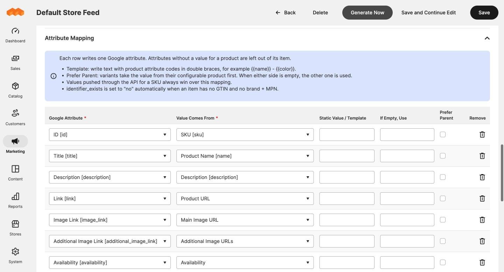

# Attribute mapping

The **Attribute Mapping** section of the feed form decides what is written for
each Google attribute.



## How a row works

Each row writes one Google attribute.

| Column | What it does |
|---|---|
| **Google Attribute** | The attribute to write, such as `title` or `brand`. Use each attribute once. If it appears twice, the lower row wins. |
| **Value Comes From** | Where the value comes from. See below. |
| **Static Value / Template** | The text to use when the source is *Static value* or *Template*. Ignored otherwise. |
| **If Empty, Use** | Text to write when the product has no value. |
| **Prefer Parent** | For variants: take the value from the configurable product first. |
| **Remove** | Deletes the row. |

If a product has no value for a row and no fallback is set, that attribute is
simply left out of the product's item.

Click **Add Attribute** at the bottom to add a row.

## Where a value can come from

### Product attributes

Any product attribute, listed as *Label [code]*. Dropdown and multi-select
attributes are written as their labels in the feed's store view, not as IDs.
HTML is removed.

### Static value

The same text for every product. Useful for `condition` (`new`) or a brand
when you sell only one.

### Template

Text with product attribute codes in double braces:

```
{{name}} - {{color}} - {{size}}
```

Empty attributes are dropped and leftover separators at the ends are tidied,
so a product without a size becomes `Radiant Tee - Orange`.

### Built-in values

| Source | Writes |
|---|---|
| **Product URL** | The storefront URL. Variants without their own page link to the parent. |
| **Main Image URL** | The base image. A variant without one uses the parent's. |
| **Additional Image URLs** | Up to ten other gallery images. |
| **Price** | The regular price with currency, for example `34.00 USD`. |
| **Sale Price** | The final price, only when a special price or catalogue price rule puts it below the regular price. |
| **Availability** | `in_stock` or `out_of_stock`, from the salable quantity. |
| **Category Path** | The product's deepest store category, for example `Women > Tops > Tees`. |
| **Parent SKU (variants only)** | The configurable product's SKU, used to group variants. |
| **Weight with Unit** | The weight and the store's unit, for example `1 lb`. |

## The default mapping

A new feed starts with these rows. Rows for attributes your store does not
have are skipped.

| Google attribute | Comes from |
|---|---|
| `id` | SKU |
| `title` | Product name |
| `description` | Description |
| `link` | Product URL |
| `image_link` | Main image URL |
| `additional_image_link` | Additional image URLs |
| `availability` | Availability |
| `price` | Price |
| `sale_price` | Sale price |
| `brand` | Manufacturer (parent first) |
| `condition` | Static value `new` |
| `product_type` | Category path |
| `item_group_id` | Parent SKU |
| `color`, `size` | The attributes of the same name |
| `gender`, `material`, `pattern` | The attributes of the same name (parent first) |
| `shipping_weight` | Weight with unit |

Keep `id` mapped to SKU if you use the reporting system. It matches Google Ads
spend to orders by that value.

## Variants of configurable products

Each variant is its own item with the parent SKU as `item_group_id`.

A variant often has only a name, a colour and a size, while the description,
brand and material live on the parent. So for product attributes:

- Without **Prefer Parent**, the variant's own value is used, and the parent's
  when the variant has none.
- With **Prefer Parent**, the parent's value is used, and the variant's when
  the parent has none.

Tick **Prefer Parent** for anything that should be identical across variants,
such as brand. Leave it off for anything that differs, such as colour.

## Identifiers: GTIN, MPN and brand

Google wants a GTIN, or a brand together with an MPN.

- A default Magento catalogue has no GTIN or MPN attribute, so those rows start
  unmapped. Map them to your own attributes if you have them.
- When an item has neither, `identifier_exists` is set to `no` automatically.
  You do not need a row for it.
- To set it yourself, add an `identifier_exists` row. Your value is then used.

## Google product category

`google_product_category` is Google's own category list, such as
`Apparel & Accessories > Clothing > Shirts & Tops`. It is not mapped by
default, and there is no screen for matching each store category to a Google
category.

Your store's own category path is written to `product_type` instead, which
Google uses for campaign organisation.

To fill `google_product_category`, you can:

1. **Leave it out.** Google assigns a category automatically from the title,
   description and other data. This is enough for most catalogues.
2. **Use a static value** when the whole feed is one kind of product. Add a
   `google_product_category` row with *Static value* and the category name or
   its numeric ID.
3. **Use a product attribute.** Create a product attribute holding the Google
   category, fill it per product (or on the configurable parent, with **Prefer
   Parent** ticked), and map the row to it.
4. **Push it per SKU through the AI connector or the API.** The reporting system can set it for
   each product. See [Google attribute values per product](google-attribute-values.md).

## Limits applied for you

- Titles are cut to 150 characters and descriptions to 5,000.
- HTML tags are removed from text.
- Characters that are not valid in XML are removed.

## Values that override the mapping

A value pushed through the AI connector or the API for a SKU always wins over the mapping for that
product. See [Google attribute values per product](google-attribute-values.md).
