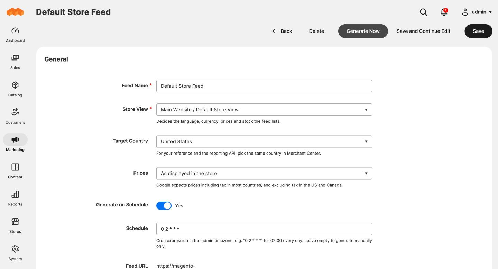
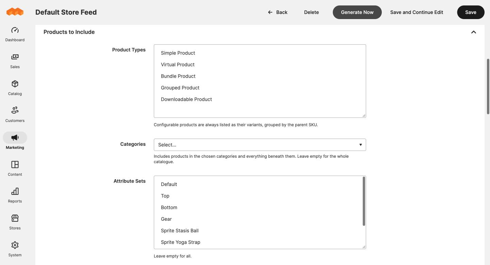
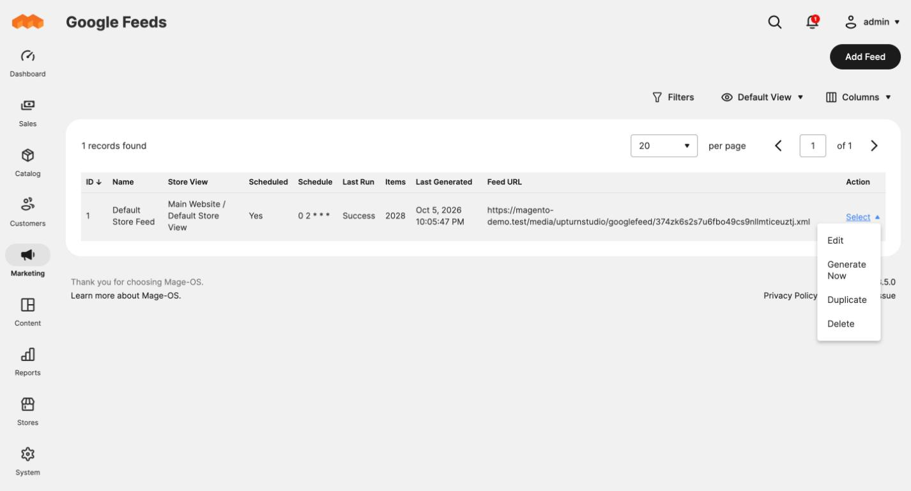

# Creating a feed

**Marketing > SEO & Search > Google Feeds > Add Feed**

A feed is one XML file for one store view. Create a separate feed for each
country, language or currency you advertise in.

## General settings

| Field | What it does |
|---|---|
| **Feed Name** | Your own label. It is also the title inside the file. |
| **Store View** | Decides the language of names and descriptions, the currency, the prices, the product URLs and which stock is checked. |
| **Target Country** | For your reference and for the reporting system. It does not change the file. Pick the same country in Merchant Center. |
| **Prices** | Whether prices include tax. *As displayed in the store* follows the store view's catalogue price display setting. Google expects prices including tax in most countries, and excluding tax in the US and Canada. |
| **Generate on Schedule** | When on, the feed is generated automatically according to **Schedule**. When off, it is only generated when you ask. |
| **Schedule** | A cron expression in the admin timezone. `0 2 * * *` means 02:00 every day. Leave it empty to generate manually only. |
| **Feed URL** | Shown once the feed has been saved. Give this to Merchant Center. It works after the first generation. |

### Schedule examples

| Expression | Runs |
|---|---|
| `0 2 * * *` | Every day at 02:00 |
| `0 */6 * * *` | Every six hours |
| `30 1 * * 1-5` | Weekdays at 01:30 |
| `0 * * * *` | Every hour |

## Products to include

Every filter is optional. Left empty, a filter does not restrict anything.

| Filter | What it does |
|---|---|
| **Product Types** | Which product types are listed. With nothing selected, simple, virtual and downloadable products are listed. Hold Ctrl or Cmd to select several. |
| **Categories** | Lists only products in the chosen categories, including everything beneath them. A variant counts as being in its parent's categories. |
| **Attribute Sets** | Lists only products using the chosen attribute sets. |
| **Visibility** | Lists only products with the chosen storefront visibility. |
| **Leave Out Unavailable Products** | When on, products that cannot be bought are left out. When off, they are listed as `out_of_stock`, which keeps their history in Merchant Center. Off is usually the better choice. |

### What is always true

- Only enabled products assigned to the store view's website are listed.
- Configurable products are never listed themselves. Their variants are, each
  with the parent SKU as its group ID.
- A product that is *Not Visible Individually* is listed only if it is a
  variant of a visible configurable product. Its link then goes to the
  parent's page.
- A product without an ID or a link is left out, because Google cannot use it.

## Saving

- **Save** returns to the grid.
- **Save and Continue Edit** stays on the form.
- **Generate Now** queues the feed using its last saved settings. Save first
  if you have made changes.
- **Delete** removes the feed and its generated file. Merchant Center will then
  fail to fetch it, so remove the data source there too.

## Copying a feed

In the grid, open the **Select** menu on a row and choose **Duplicate**. The
copy has the same store view, filters and mapping, gets its own URL, and
starts with **Generate on Schedule** off so you can review it first.

