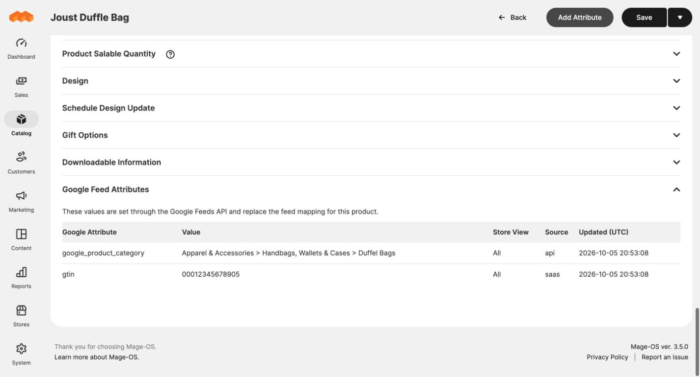

# Google attribute values per product

The reporting system can set Google attribute values for individual products.
This is how optimised titles, Google categories, GTINs and custom labels reach
the feed without anyone editing the catalogue.

## What they do

A value is stored for a SKU and a Google attribute, for example:

| SKU | Google attribute | Value |
|---|---|---|
| 24-MB01 | `google_product_category` | Apparel & Accessories > Handbags, Wallets & Cases > Duffel Bags |
| 24-MB01 | `gtin` | 00012345678905 |
| 24-MB04 | `custom_label_0` | low-roas |

When the feed is generated:

- A stored value **replaces** whatever the mapping would have written for that
  product and attribute.
- A stored value can add an attribute the feed does not map at all.
- A stored **empty** value removes the attribute from that product's item.
- A value can apply to every store view or to one. A value for a specific
  store view wins over the all-stores value.

Nothing changes in the feed until it is generated again.

These values live in the module's own storage. They are not product attributes
and do not change your catalogue data or your storefront.

## Seeing what is set on a product

Open the product in **Catalog > Products** and scroll to **Google Feed
Attributes** at the bottom. The section only appears when the product has
stored values.

| Column | Meaning |
|---|---|
| **Google Attribute** | The attribute being overridden. |
| **Value** | The stored value. *(removed from feed)* means it was stored empty on purpose. |
| **Store View** | *All*, or the ID of one store view. |
| **Source** | A label supplied by whoever wrote it. |
| **Updated (UTC)** | When it was last written. |

The section is read-only. Values are managed through the AI connector tools or the REST API.

## Typical uses

- **Custom labels** for campaign structure, such as `custom_label_0` set to
  `bestseller`, `low-roas` or `clearance` from performance data.
- **Google product category** per product, when automatic categorisation is
  not good enough.
- **GTIN and MPN** when they are held in another system.
- **Improved titles and descriptions** for ads, without touching the
  storefront copy.
- **Removing a product from an ad group** by changing a label, or suppressing
  a mapped attribute with an empty value.

## Changing or removing a value

Ask whoever runs the reporting system, or use the `google_feed_delete_attribute_values` tool or the REST API directly. Removing a
stored value hands that attribute back to the feed mapping.

Deleting a product does not delete its stored values. They are harmless, since
a SKU that is not in the catalogue is never listed, and they apply again if the
SKU returns.

Developers: see the [AI connector tools reference](../docs/mcp-tools.md) and the [REST API reference](../docs/api.md).
